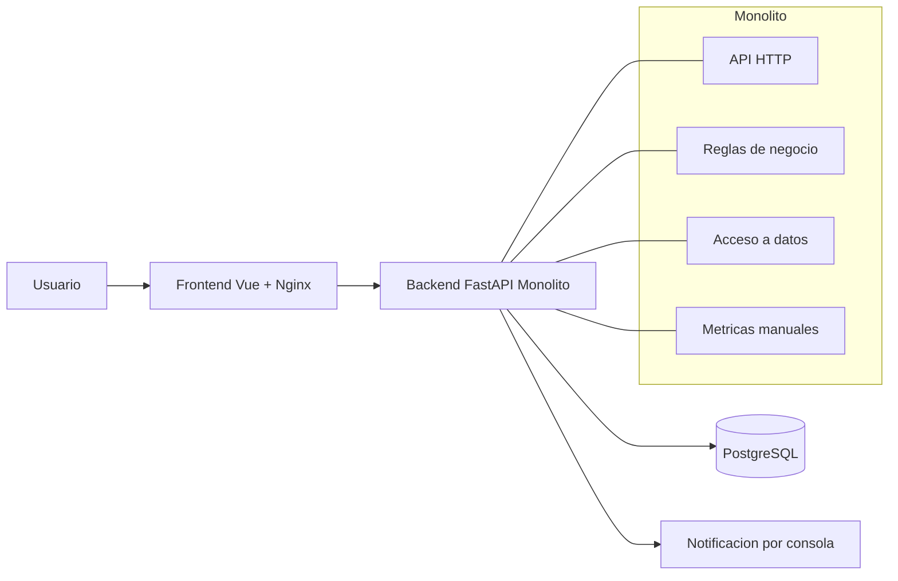
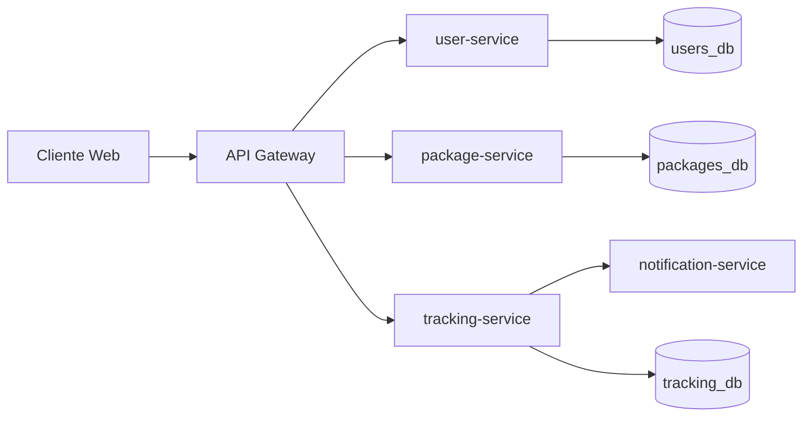
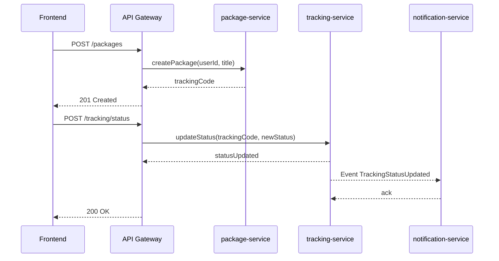

# Migracion de Monolito a Microservicios

## Informe Tecnico Hito 1

- Proyecto: Sistema de Tracking de Paquetes
- Curso: Ingenieria de Software
- Fecha: 02-04-2026
- Integrantes: Completar
- Profesor: Completar

## 1. Introduccion

El objetivo de este hito es analizar una aplicacion monolitica intencionalmente mal disenada y proponer una arquitectura objetivo basada en microservicios. El sistema actual permite crear usuarios, crear paquetes, actualizar estados de tracking y consultar eventos historicos. La migracion busca reducir acoplamiento, mejorar mantenibilidad, habilitar escalado independiente por capacidad y fortalecer observabilidad.

Este informe no se limita a describir una arquitectura ideal: contrasta el estado actual del codigo con los criterios de calidad de arquitectura del curso (cohesion, bajo acoplamiento, resiliencia y observabilidad), y justifica decisiones de migracion para minimizar riesgo de entrega.

## 2. Descripcion del Sistema

### 2.1. Contexto General

Dominio: logistica y tracking de paquetes.

Actores principales:

- Operador: registra usuarios y paquetes.
- Sistema: actualiza estados de envio.
- Cliente final: consulta tracking por codigo.

Componentes actuales:

- Frontend Vue 3 servido por Nginx.
- Backend FastAPI monolitico.
- Base de datos PostgreSQL unica.

Flujo funcional principal actual:

1. El operador crea un usuario.
2. El operador registra un paquete para ese usuario.
3. El sistema crea eventos de tracking como filas sucesivas.
4. El cliente consulta estado e historial por tracking code.

Este flujo confirma que la aplicacion esta orientada a eventos de estado, pero aun sin separacion formal de contextos de dominio.

### 2.2. Alcance

Incluye:

- Gestion de usuarios basica.
- Creacion de paquetes con codigo de tracking.
- Transicion de estados de envio.
- Consulta de historial de tracking.
- Despliegue local con Docker Compose.

No incluye:

- Autenticacion/autorizacion.
- Integracion con carriers externos.
- Notificaciones reales (email/SMS/push).
- Trazabilidad distribuida real.

## 3. Analisis Arquitectonico AS-IS

### 3.1. Descripcion de la Arquitectura Actual

El backend concentra en un solo modulo HTTP, reglas de negocio, acceso a datos y eventos de notificacion por consola. El frontend consume endpoints directos del backend por URL absoluta. La persistencia usa una tabla central que mezcla identidad de usuario, paquete y eventos de estado.

Desde perspectiva arquitectonica, el sistema es un monolito transaccional con tres caracteristicas relevantes:

- Acoplamiento estructural alto: las capas estan mezcladas en una misma unidad de despliegue y codigo.
- Acoplamiento temporal alto: cambios en validaciones o modelos impactan simultaneamente API, DB y UI.
- Baja trazabilidad de fallas: no hay taxonomia consistente de errores ni correlacion de eventos.

### 3.2. Requerimientos

#### 3.2.1. Requerimientos Funcionales

- RF1: Crear usuario con username y email.
- RF2: Crear paquete para un usuario con tracking unico.
- RF3: Actualizar estado de un paquete con trazabilidad historica.
- RF4: Consultar estado actual e historial por tracking code.
- RF5: Exponer endpoint de salud.
- RF6: Exponer metricas basicas de negocio.

#### 3.2.2. Requerimientos No Funcionales

- RNF1: Disponibilidad local de servicios via contenedores.
- RNF2: Baja latencia de consulta para tracking.
- RNF3: Persistencia transaccional en PostgreSQL.
- RNF4: Interoperabilidad HTTP/JSON con frontend web.
- RNF5: Facilidad de despliegue para laboratorio.

### 3.3. Problemas Identificados

Deuda tecnica:

- Endpoints no REST y convenciones inconsistentes.
- Parseo manual de request body repetido en varios handlers.
- Manejo de errores generico y poco trazable.
- CORS totalmente abierto.

Justificacion de "manejo de errores generico":

- En multiples endpoints se captura Exception de forma global y se responde con mensajes ambiguos como "something went wrong".
- No se diferencia entre errores de validacion, reglas de negocio, integridad de datos o fallas de infraestructura.
- No se propaga contexto tecnico minimo (codigo interno, causa, correlacion) que permita diagnostico rapido.
- El resultado operativo es alto MTTR: cuando hay falla, el equipo ve muchos 500 similares y poco contexto para aislar origen.

Impacto esperado:

- Dificulta observabilidad (no hay clasificacion por tipo de error).
- Aumenta tiempo de soporte y riesgo de regresiones.
- Impide construir alertas accionables basadas en causas.

Acoplamientos criticos:

- Logica de negocio, transporte y persistencia mezclados en una sola unidad.
- Frontend acoplado a URL absoluta del backend.
- Notificaciones simuladas acopladas al backend principal.

Otros acoplamientos criticos identificados (punteo para documentacion):

- Acoplamiento de arranque con datos de prueba: el backend ejecuta seed en startup, mezclando ciclo de vida de la aplicacion con inicializacion de datos.
- Acoplamiento API-DB: los handlers HTTP acceden directamente a la sesion y consultas SQLAlchemy, sin una capa intermedia de servicio/repositorio.
- Acoplamiento por contrato de estados: los estados de negocio estan hardcodeados en el mismo modulo API, dificultando versionado y evolucion de reglas.
- Acoplamiento transaccional con notificaciones: la notificacion se dispara desde el mismo flujo de actualizacion, sin cola ni aislamiento ante fallos.
- Acoplamiento de UI con estado global improvisado: uso de variable global en window para coordinar flujos de usuario/paquete.
- Acoplamiento por duplicacion de datos de dominio: tracking_data replica username y email, creando dependencia estructural entre identidad y eventos.
- Acoplamiento por falta de integridad referencial: user_id en tracking_data no esta modelado como FK real, aumentando riesgo de inconsistencias.
- Acoplamiento de configuracion al entorno local: defaults de conexion y credenciales en codigo favorecen dependencia a un entorno especifico.

Justificacion de cada acoplamiento:

- Logica de negocio, transporte y persistencia en una sola unidad: cualquier cambio en validaciones o modelo de datos obliga a tocar el mismo modulo HTTP, aumentando el radio de impacto y la probabilidad de regresion.
- Frontend acoplado a URL absoluta del backend: un cambio de host, puerto, version o estrategia de enrutamiento rompe el cliente, porque no existe capa de abstraccion (gateway/BFF o configuracion por entorno).
- Notificaciones simuladas acopladas al backend principal: al ejecutarse dentro del mismo flujo de peticion, una futura falla de notificacion puede degradar operaciones core (crear/actualizar tracking).
- Arranque acoplado con seed de datos: el ciclo de vida de la API depende de inicializacion de datos de prueba, lo que mezcla responsabilidades de despliegue con bootstrap funcional.
- Acoplamiento API-DB (sin capa de servicio/repositorio): los endpoints conocen detalles de persistencia y sesiones, dificultando cambiar esquema, ORM o estrategia de acceso sin modificar contratos de API.
- Contrato de estados hardcodeado en API: las reglas de dominio quedan embebidas en el mismo modulo de transporte, impidiendo evolucionar estados con gobernanza y versionado controlado.
- Acoplamiento transaccional con notificaciones: no existe desacople asincrono (cola/event bus), por lo que se pierde tolerancia a fallos y capacidad de reintento independiente.
- UI acoplada a estado global improvisado (window): la coordinacion entre flujos depende de estado compartido no tipado ni encapsulado, elevando fragilidad y dificultad de pruebas.
- Duplicacion de datos de dominio en tracking_data: replicar username/email dentro de eventos rompe principio de unica fuente de verdad y genera riesgo de desalineacion historica.
- Falta de integridad referencial (sin FK real): la base no protege consistencia entre entidades, permitiendo registros huerfanos y aumentando costo de limpieza y auditoria.
- Configuracion acoplada al entorno local: valores por defecto en codigo (incluyendo credenciales) favorecen comportamientos implícitos y errores de despliegue entre ambientes.

Cuellos de botella:

- Una sola base de datos y una tabla central para multiples responsabilidades.
- No hay escalado independiente por capacidad funcional.
- Consulta de ultimo estado se resuelve en Python en memoria y no en SQL optimizado.
- Patrón de escritura append-only en una tabla unica sin particion por dominio ni estrategia de archivado.
- Competencia por recursos entre operaciones de escritura (updateStatus) y lectura (getTracking/getAllPackages) sobre la misma estructura.
- Punto unico de fallo en backend monolitico: toda operacion de negocio depende de un solo proceso y mismo pool de conexiones.

Justificacion:

- La tabla tracking_data concentra alta escritura y lectura, convirtiendose en hotspot natural.
- El backend solo puede escalar en bloque aunque el trafico se concentre en lectura de tracking.
- Resolver agregaciones en aplicacion incrementa consumo de CPU y memoria bajo concurrencia.
- Al no separar contextos de persistencia, crece el volumen historico en la misma tabla y se degrada progresivamente el tiempo de consulta.
- Mezclar lecturas y escrituras intensivas sobre el mismo objeto de datos aumenta latencia p95/p99 en horas de carga.
- El endpoint getAllPackages realiza postproceso en memoria para obtener el ultimo estado por tracking, trasladando trabajo desde la base hacia la API.
- La ausencia de cache para consultas frecuentes de tracking obliga a recalcular resultados en cada solicitud.
- Una degradacion en PostgreSQL impacta simultaneamente creacion de paquetes, actualizacion de estados y consultas de cliente.

Impacto operativo esperado de estos cuellos de botella:

- Aumento no lineal de latencia a medida que crece el historico de eventos.
- Menor throughput efectivo del backend por saturacion de CPU y conexiones.
- Mayor tasa de timeout bajo picos concurrentes de lectura/escritura.
- Dificultad para cumplir SLA por falta de aislamiento de cargas por dominio.

Lineas de mitigacion recomendadas (AS-IS -> TO-BE):

- Separar persistencia por contexto (users, packages, tracking) para reducir contencion.
- Optimizar consultas de ultimo estado en SQL (window functions o subquery por max(recorded_at/id)).
- Incorporar cache de lectura para tracking de alta recurrencia.
- Definir retencion/archivado de eventos historicos y estrategia de particion temporal.
- Escalar horizontalmente componentes de lectura y aplicar patron CQRS en fase posterior si la carga lo requiere.

### 3.4. Diagramas AS-IS



## 4. Diseno Arquitectonico TO-BE

### 4.1. Estrategia de Migracion

Se propone aplicar Strangler Pattern en fases:

- Fase 1: introducir API Gateway delante del monolito.
- Fase 2: extraer servicio de Usuarios.
- Fase 3: extraer servicio de Paquetes.
- Fase 4: extraer servicio de Tracking/Eventos.
- Fase 5: aislar notificaciones asincronas.
- Fase 6: descomisionar endpoints legacy del monolito.

Argumentacion de por que Strangler Pattern es la estrategia adecuada:

- Reduce riesgo de negocio: evita una reescritura total (big bang), que en este sistema aumentaria probabilidad de regresion por el alto acoplamiento existente.
- Mantiene continuidad operativa: el monolito sigue atendiendo mientras se migran capacidades de forma incremental.
- Permite validar por iteraciones: cada dominio extraido se prueba en produccion/controlado antes de avanzar al siguiente.
- Mejora trazabilidad de impacto: al mover una capacidad a la vez, es mas facil medir latencia, errores y estabilidad por servicio.
- Facilita rollback: si una extraccion falla, el gateway puede redirigir temporalmente al endpoint legacy sin detener toda la plataforma.

Como se ejecuta la migracion (paso a paso):

1. Colocar API Gateway como punto unico de entrada, sin cambiar inicialmente la logica de negocio.
2. Definir fronteras de dominio (usuarios, paquetes, tracking) y contratos API por capacidad.
3. Implementar user-service y enrutar solo los endpoints de usuario al nuevo servicio; mantener el resto en monolito.
4. Extraer package-service con su propia persistencia o esquema aislado; eliminar escritura dual en monolito cuando la consistencia este validada.
5. Extraer tracking-service, priorizando consultas criticas de estado actual e historial.
6. Migrar notificaciones a un flujo asincrono (eventos/cola) para desacoplarlas del request principal.
7. Retirar rutas legacy del monolito una vez cumplidos criterios de salida (estabilidad, rendimiento y monitoreo).

Manejo de datos durante la transicion:

- Etapa inicial: coexistencia controlada, minimizando cambios de esquema bruscos.
- Etapa intermedia: separacion progresiva por contexto, evitando duplicacion no gobernada.
- Etapa final: cada servicio con responsabilidad de datos acotada y contratos de integracion estables.

Riesgos y mitigaciones:

- Riesgo: inconsistencia temporal entre componentes durante extraccion.
    Mitigacion: versionado de contratos, pruebas de regresion y monitoreo por endpoint.
- Riesgo: aumento de complejidad operativa temprana.
    Mitigacion: observabilidad minima obligatoria en cada fase (latencia, errores, throughput).
- Riesgo: dependencia residual al monolito por rutas no migradas.
    Mitigacion: backlog de retiro de endpoints legacy con fechas y responsables.

Criterios de salida por fase:

- Contrato estable publicado (OpenAPI/eventos versionados).
- Pruebas de regresion del flujo critico superadas.
- Monitoreo minimo por servicio (latencia, errores, throughput).
- Plan de rollback definido por release.

### 4.2. Definicion de Microservicios

- Servicio 1 - user-service: crea y consulta usuarios.
- Servicio 2 - package-service: crea paquetes y asigna tracking.
- Servicio 3 - tracking-service: administra estados e historial.
- Servicio 4 - notification-service (minimo viable): envia eventos de notificacion de forma asincrona.
- API Gateway: punto unico de entrada y enrutamiento.

Razonamiento de particion por contexto:

- user-service: contexto de identidad y datos de cliente.
- package-service: contexto de ciclo de vida inicial del envio.
- tracking-service: contexto de eventos y estado actual.
- notification-service: contexto de comunicacion externa.

Esta particion reduce dependencia entre dominios con diferentes ritmos de cambio.

### 4.3. Arquitectura General



### 4.4. Comunicacion entre Servicios

- Sincrona: REST para consultas y comandos inmediatos.
- Asincrona: eventos de dominio para cambios de estado (ejemplo: TrackingStatusUpdated).
- Contratos: OpenAPI para REST y esquema versionado para eventos.

Justificacion de enfoque hibrido:

- REST simplifica operaciones request/response de baja latencia.
- Eventos reducen acoplamiento temporal cuando el receptor puede procesar posteriormente.
- La combinacion permite mantener UX responsiva sin bloquear operaciones secundarias (ejemplo: notificar).

### 4.5. Diagrama de Secuencia



## 5. Patrones Arquitectonicos

### 5.1. API Gateway

Problema:

- Multiples servicios exponen APIs y complejizan consumo del frontend.

Solucion:

- Un gateway centraliza rutas, CORS, autenticacion futura y politicas transversales.

Justificacion:

- Reduce acoplamiento del cliente y permite evolucion interna sin romper contratos publicos.
- Centraliza politicas transversales: rate limiting, autenticacion futura, versionado y observabilidad de borde.
- Permite encapsular la deuda tecnica del monolito detras de una interfaz estable, reduciendo impacto en frontend durante la migracion.
- Facilita despliegues incrementales: una ruta puede migrarse a microservicio mientras otras siguen apuntando al monolito.
- Mejora seguridad y gobernanza: un punto unico simplifica aplicar politicas de acceso, validacion de headers y trazabilidad de peticiones.
- Disminuye costo de mantenimiento del cliente, evitando multiples integraciones directas por cada servicio nuevo.

### 5.2. Saga Pattern

Problema:

- Operaciones distribuidas (crear paquete + registrar primer estado + notificar) pueden fallar parcialmente.

Solucion:

- Saga coreografiada por eventos con acciones compensatorias (anular paquete o marcar inconsistencia).

Justificacion:

- Evita transacciones distribuidas ACID y mantiene consistencia eventual controlada.
- Encaja con el dominio de tracking, donde pequenos desfases temporales son aceptables si existe reconciliacion.
- Modela correctamente la realidad operativa del negocio: crear paquete, registrar estado inicial y notificar son pasos relacionados pero tecnicamente desacoplables.
- Permite compensaciones explicitas ante fallos parciales (ejemplo: marcar envio en estado de excepcion o revertir registro incompleto).
- Aumenta auditabilidad del proceso distribuido, ya que cada paso de la saga deja evidencia de estado y decision.
- Evita bloqueos prolongados por esperas entre servicios, mejorando robustez bajo carga y latencias variables.

### 5.3. Circuit Breaker

Problema:

- Falla de un servicio dependiente puede propagar latencia y timeout a toda la plataforma.

Solucion:

- Circuit breaker en llamadas del gateway a servicios y entre servicios criticos.

Justificacion:

- Mejora resiliencia y limita efecto cascada.
- Permite estrategias de fallback (respuesta degradada) y protege recursos ante reintentos masivos.
- Protege al gateway y a servicios consumidores de degradaciones prolongadas en dependencias lentas o inestables.
- Mejora experiencia de usuario al responder rapido con fallback controlado en lugar de esperar timeouts largos.
- Reduce saturacion de infraestructura al cortar temporalmente llamadas hacia servicios en falla, evitando tormentas de reintentos.
- Entrega señales operativas claras (open/half-open/closed) utiles para observabilidad y respuesta a incidentes.

### 5.4. Strangler Pattern

Problema:

- Reescritura total del monolito es riesgosa y costosa.

Solucion:

- Extraccion incremental de capacidades de negocio conservando continuidad operativa.

Justificacion:

- Reduce riesgo de entrega y habilita validacion por iteraciones.
- Permite medir impacto real por capacidad extraida antes de avanzar a la siguiente.
- Es coherente con el estado actual del sistema: existe una base funcional que no conviene desechar mediante reescritura total.
- Minimiza riesgo de interrupcion operativa al permitir coexistencia entre rutas legacy y rutas migradas.
- Alinea esfuerzo tecnico con valor de negocio, priorizando extraccion de capacidades mas criticas o con mayor dolor operativo.
- Habilita rollback por dominio: si una extraccion falla, se puede redirigir trafico al monolito sin comprometer todo el sistema.

## 6. Implementacion Tecnica

### 6.1. Arquitectura de Despliegue

Punteo breve de la arquitectura implementada:

- Frontend con Vue.js + Nginx: interfaz web en contenedor independiente (8080) que consume por HTTP los endpoints del backend para el flujo de usuarios, paquetes y tracking.
- API Gateway: no existe contenedor dedicado en el prototipo; el backend cumple temporalmente el rol de entrada unica, manteniendo compatibilidad con la UI actual.
- Contenedores de servicios: las capacidades de autenticacion, packages y tracking permanecen dentro del backend monolitico para reducir complejidad inicial y habilitar migracion incremental.
- Persistencia: PostgreSQL 15 centraliza users y tracking_data, sosteniendo createPackage, updateStatus, getTracking y getAllPackages con consistencia funcional en esta fase.
- Cola de eventos: no implementada aun; las notificaciones siguen acopladas al backend de forma sincrona y su desacople asincrono queda como siguiente iteracion.

Validacion operativa del despliegue:

- Build y levantamiento exitoso con Docker Compose.
- Publicacion de puertos 8080 (frontend), 8000 (backend) y 5432 (postgres).
- Arranque del backend condicionado al healthcheck de PostgreSQL para mejorar repetibilidad.

### 6.2. Docker Compose

Docker Compose se implementa como mecanismo de orquestacion minimo viable para levantar el entorno completo con un solo comando y con comportamiento reproducible entre equipos. El archivo define tres servicios: postgres, con volumen persistente y healthcheck; backend, que concentra la logica de usuarios, paquetes, tracking, salud y metricas; y frontend, que publica la interfaz Vue mediante Nginx. Esta composicion entrega el nivel de aislamiento necesario para pruebas de integracion sin exigir una plataforma de orquestacion mas compleja.

El acoplamiento operativo queda explicitado de forma simple: el frontend consume al backend por HTTP/JSON y el backend persiste en PostgreSQL via SQLAlchemy. Ademas, la dependencia de backend respecto a postgres healthy reduce fallas de inicializacion por carrera de arranque. En terminos de justificacion, esta estrategia permite depurar mas rapido, mantener trazabilidad de cambios y preparar la extension futura del compose con gateway, cola y servicios especializados.

Comando de ejecucion validado:

```bash
docker compose up -d --build
```

### 6.3. Base de Datos

Tecnologia: PostgreSQL 15.

PostgreSQL 15 se utiliza como persistencia principal del prototipo por su estabilidad transaccional, madurez operativa y compatibilidad directa con SQLAlchemy. En esta etapa, la base soporta de forma efectiva el flujo funcional completo: creacion de usuarios, registro de paquetes, actualizacion de estados e historial de tracking por codigo.

El modelo de tracking implementa un enfoque append-only: cada cambio de estado se registra como un nuevo evento en lugar de sobrescribir el estado previo. Esta decision permite mantener trazabilidad historica completa, requisito clave del dominio logistico, y al mismo tiempo simplifica la auditoria funcional del ciclo de vida de cada paquete.

Desde la perspectiva de acople, la persistencia actual mantiene compatibilidad con el monolito y con el frontend existente, ya que los endpoints createPackage, updateStatus, getTracking y getAllPackages reutilizan el mismo historico de eventos. La desventaja es que persisten caracteristicas de deuda tecnica (denormalizacion y ausencia de FK formales), por lo que la evolucion recomendada es migrar por fases a persistencia por contexto (auth/users, packages, tracking), con contratos estables y plan de migracion de datos controlado.

Riesgos de la persistencia actual:

- Inconsistencias por duplicacion de datos de usuario en eventos.
- Complejidad de auditoria al no existir relacion formal entre entidades.
- Mayor costo de evolucion de esquema por baja normalizacion.

## 7. Observabilidad

### 7.1. Herramientas Utilizadas

Para este hito se define como stack de observabilidad Prometheus + Grafana, por ser una combinacion estandar en entornos contenerizados y por su capacidad de entregar medicion continua, historico temporal y visualizacion operativa.

En el estado actual del prototipo existe un endpoint /metrics propio del backend que entrega indicadores basicos de negocio. Sin embargo, este endpoint no reemplaza instrumentacion Prometheus formal porque no expone series etiquetadas por endpoint, metodo y codigo de respuesta, ni permite analisis temporal robusto por ventana de tiempo.

En terminos de cierre del hito, la implementacion objetivo considera: scraping periodico con Prometheus, dashboard operativo en Grafana y alertas iniciales para latencia, tasa de error y saturacion de recursos.

### 7.2. Metricas

Las metricas minimas definidas para evaluar salud del sistema son: latencia, throughput, tasa de errores y uso de recursos por servicio. En el estado actual, el prototipo reporta total_packages, total_events y average_processing_time (simulada), utiles como linea base de negocio pero insuficientes para operacion tecnica.

Para cumplir criterio de observabilidad se requiere instrumentar metricas tecnicas por endpoint y por servicio, incluyendo percentiles de latencia (p50, p95, p99), requests por segundo, errores 4xx/5xx y consumo de CPU/memoria por contenedor. Esta granularidad es necesaria para detectar degradacion progresiva, localizar cuellos de botella y priorizar acciones de mitigacion.

### 7.3. Dashboards

El dashboard principal en Grafana debe concentrar cuatro paneles operativos: latencia por endpoint, throughput por servicio, tasa de error y consumo de recursos. Como practicas recomendadas, cada panel debe incluir rango temporal configurable, filtros por servicio y umbrales visuales para identificar desvio de comportamiento esperado.

Para el informe, la evidencia sugerida es una captura del dashboard con trafico de prueba ejecutado durante al menos 10 a 15 minutos, mostrando variacion de carga y comportamiento de la API en condiciones normales.

### 7.4. Analisis de Metricas

Con las metricas actuales solo es posible una lectura parcial del sistema. El analisis operacional completo depende de contar con series temporales de latencia, throughput y errores por endpoint para distinguir si una degradacion proviene de capa API, base de datos o saturacion de contenedor.

Como linea de implementacion, se recomienda: instrumentar backend para scraping Prometheus, incorporar servicios de Prometheus y Grafana al compose, construir dashboard base con p95, RPS, error rate y recursos por contenedor, y definir alertas iniciales de alta severidad para error rate y latencia p95 sostenida.

Con esta instrumentacion, el equipo podra comparar comportamiento AS-IS vs TO-BE y justificar tecnicamente el impacto de la migracion en resiliencia y rendimiento.

### 7.5. Estimacion de Costos

Comparativo conceptual:

| Concepto | Monolito | Microservicios |
|---|---|---|
| Infraestructura | Menor costo inicial por menos componentes | Mayor costo por gateway, observabilidad, red interna y servicios aislados |
| Escalabilidad | Escala en bloque (sobreaprovisionamiento posible) | Escala por dominio y demanda real de cada servicio |
| Operacion | Mas simple de administrar | Mayor complejidad por despliegues, contratos, monitoreo y debugging distribuido |
| Equipo | Menor especializacion inicial requerida | Requiere mayor madurez DevOps y disciplina de integracion |
| Riesgo de cambio | Cambios pueden impactar todo el sistema | Cambios acotados por servicio, con mejor aislamiento si hay buenos contratos |

### 7.6. Analisis

El analisis economico-tecnico muestra que microservicios no reducen costo inmediato; al contrario, elevan costo operativo inicial por la necesidad de mas componentes, monitoreo y gobernanza de contratos. Su ventaja aparece cuando el sistema crece en carga y en ritmo de cambio por dominio, porque permiten escalar y desplegar capacidades de forma selectiva.

Para este proyecto, la recomendacion es una transicion gradual: mantener simplicidad operativa donde sea posible, pero introducir desacople en dominios con mayor dolor (tracking y notificaciones). Esta estrategia evita sobreingenieria temprana y al mismo tiempo prepara una arquitectura sostenible para crecimiento futuro.

## 8. Trade-offs

Beneficios:

- Desacoplamiento por dominio y menor impacto cruzado de cambios.
- Escalado independiente de componentes con comportamiento de carga distinto.
- Mejor resiliencia al aplicar API Gateway, Circuit Breaker y mensajeria asincrona.
- Posibilidad de despliegues incrementales con rollback por capacidad.
- Mayor trazabilidad operacional cuando existe observabilidad por servicio.

Desventajas:

- Mayor complejidad de operacion, diagnostico y monitoreo distribuido.
- Necesidad de contratos versionados y disciplina de gobernanza entre servicios.
- Incremento en el esfuerzo de testing (integracion, contratos, resiliencia).
- Mayor costo cognitivo para onboarding y mantenimiento por parte del equipo.
- Sobrecosto inicial de infraestructura para ambientes de desarrollo y pruebas.

Cuando NO usar microservicios:

- Producto en etapa temprana con requerimientos altamente cambiantes.
- Equipo pequeno sin capacidad operativa para DevOps/observabilidad.
- Carga baja y estable donde un monolito modular cumple SLA sin friccion.
- Contextos donde el costo de coordinacion supera el beneficio de desacople.

## 9. Conclusiones

El sistema actual demuestra funcionalidad de negocio, pero evidencia deuda tecnica y acoplamiento alto propios de un monolito no modular. La propuesta TO-BE basada en microservicios aborda estos problemas con una estrategia incremental, manteniendo continuidad operativa mientras se extraen dominios de forma controlada.

La principal conclusion tecnica es que la migracion debe ser guiada por riesgo y evidencia: primero consolidar contratos, instrumentacion y criterios de salida; luego ejecutar extracciones por dominio con validacion operativa en cada fase. De esta manera, se evita reemplazar una deuda monolitica por deuda distribuida.

Como cierre de hito, el equipo dispone de una arquitectura objetivo coherente, una ruta de migracion viable y un plan de observabilidad que permite medir impacto real en rendimiento, resiliencia y mantenibilidad.

## 10. Referencias

- Repositorio del proyecto: https://github.com/juaco323/arqSfw_H-1
- FastAPI Documentation: https://fastapi.tiangolo.com/
- Docker Compose Documentation: https://docs.docker.com/compose/
- PostgreSQL Documentation: https://www.postgresql.org/docs/
- Prometheus Documentation: https://prometheus.io/docs/
- Grafana Documentation: https://grafana.com/docs/
- Microservices.io Patterns: https://microservices.io/patterns/